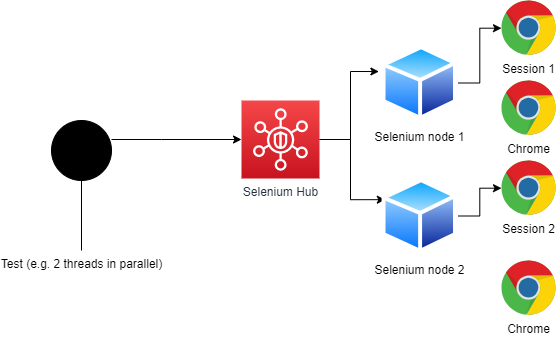
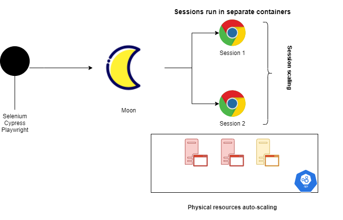
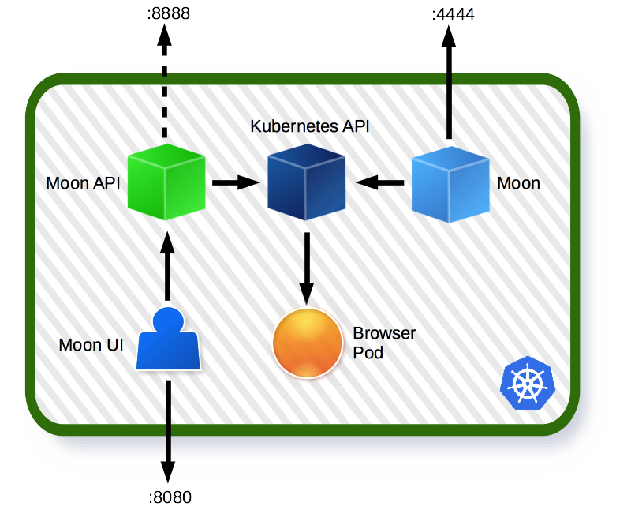
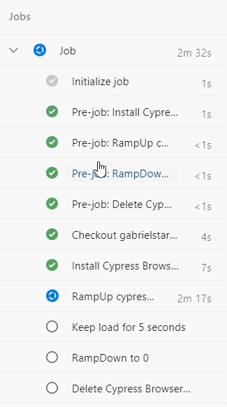

## Load testing with a browser

When can you be tempted to do that ? When ...

- you have no other options (e.g. one cannot correlate the traffic at the protocol level)
- you want so make sure you do it "exactly" as end-user and cost is acceptable
- you want to simulate user traffic in the best way possible
- your tests are relatively small ane worth the expense

Bear in mind that generating load this way is a way more expensive thing than traditional, protocol-based approaches.

***

## Browser Load Testing with Selenium and Selenium Grid

Let us first see at how Selenium can be used to do that. It is a very popular technology and most tester should know it. 

Test is run from your test script, session is requested from grid hub and directed to one of the nodes. Nodes can start number of instances of different types: Chrome, Edge, ....



In our sample repo we can execute code from [selenium](selenium) and [grid](grid) folders

```powershell
    #run selenium with local driver - driver must match browser version
    cd selenium/
    python test.py

    #run against selenium grid
    cd grid/
    ./start-grid.ps1
    ./start-nodes.ps1 #navigate to http://localhost:4444/grid/console and read IP
    python test.py
```

If we want to use more than 1 browser at a time as load testing tool we need to run tests in parallel, which can be achieved:

- with code-specific mechanisms e.g. pytest-parallel, pytest-xdist, ... 
- with external controller e.g. a script, and since this is rare I want to show you how you can do it with [powershell](runner):

```powershell
    cd ./runner
    ./parallelRunner.ps1 #will run 4 parallel sessions

```
This way we can mix any kind of solution (playwright, cypress, selenium) in one. Of course you will not do it often ... but it is possible.

Great success, we can generate load from parallel browsers but ....

> what I really want is to run my test with 20 browsers:
> -  and I want that my browsers get created without me caring for it
> -  and so that infrastructure scales automatically.
> -  I want the same for 50 browsers, 70 , etc...


The solution we have allows us to run as many browsers as we can on our infrastructure but still within the limits of our nodes (their capacity =  nodes x slots/sessions). What we need for load tests is auto-scaling of both browsers and infrastructure. Let us see how we can achieve that with Moon and Kubernetes.

***

## Moon architecture

Moon is a commercial 'Browsers Grid' that runs on Kubernetes natively. For our siltuon we can install Moon on Kubernetes and define auto-scalign rules for:

- browser instances
- hardware it runs on



Installation on AKS (Azure Kubernetes)

```powershell

    #prepare cluster
    az login
    az aks list --query "[*][name]"
    az aks get-credentials --name committed --resource-group committed 
    az aks show --name committed --resource-group committed

    #install moon
    helm repo add aerokube https://charts.aerokube.com/ 
    helm repo update 
    helm search repo aerokube --versions 
    kubectl create namespace moon
    helm upgrade --install -n moon moon aerokube/moon --version="1.1.12"

    #get external IP
    kubectl get all -nmoon helm show values aerokube/moon

```




You can visit Moon UI at http://EXTERNAL_IP:8080

Let us try how it works with:
- selenium (modify URL)
```powershell
    cd selenium/
    python test.py
```
- playwright (modify URL)
```powershell
    cd ./playwright
    npm run moon:firefox
```
- cypress
```powershell
    cd ./cypress
    npm run cy:moon:edge
```

We will use again our runner to start 4 parallel sessions.

```powershell
    cd ./runner
    ./parallelRunner.ps1 #will run 4 parallel sessions
```

Th eonly thing that is left is to turn on the AKS aut-scaling and configure limits on moon.

***
## Kubernetes scaling


| https://blog.kubecost.com/blog/requests-and-limits/

[How can a k8 cluster scale](https://docs.microsoft.com/en-us/azure/aks/cluster-autoscaler) ?


| https://docs.microsoft.com/en-us/azure/aks/media/autoscaler/cluster-autoscaler.png

| The cluster autoscaler watches for pods that can't be scheduled on nodes because of resource constraints. The cluster then automatically increases the number of nodes.


```powershell
    #enable auto-scaling 
    helm upgrade --install -n moon moon aerokube/moon --version="1.1.12" --set moon.browser.resources.cpu.requests=1.5 --set moon.browser.resources.cpu.limits=3
```
We have 3 CPUs x 2 cores in our infrastructure as compute power. By running 4 test we want to reserve 4 x 1.5 = 6 cores. This shoul trigger auto scale-up becuase kubernetes uses some cpu for itself.

Let us run our tests and wait for infrastructure to auto-scale too. It can take a couple of minutes but we should see node count going from 3 to 5.


*** 

## Using cypress (or anything else) directly with Kubernetes.

If we have no need for Moon we can use any e2e testing framework, package it into container and deploy on Kubernetes to take advantage of nodes auto-scaling.

Let us have a look at kubernetes deployment in [kubernetes](../kubernetes) folder.

```powershell
cd ./kubernetes/cypress/helm

#install
helm upgrade cy .\ --install --namespace cy --dry-run
helm upgrade cy .\ --install --namespace cy

#scale
helm upgrade cy .\ --install --namespace cy --set requests.cpu=0.2 --set replicas=45 --debug

#check number of instances - can take a while for all to pop up
kubectl get all -n cy

#delete
helm delete cy --namespace cy
```

When workload is installed, we can go and see how our application responds :)
It is possible that we will request a deployment that the cluster auto-sclaer cannot fullfill. In this case we need to modify auto-scaler policy.

***

## Doing all of that with CI - Azure DevOps

Sample pipelines can be found in [azure](./azure) folder



***

Do not forget to clean up your cluster.

```powershell
    kubectl delete namespace moon
    kubectl delete namespace cy
```
