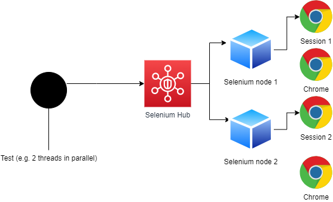
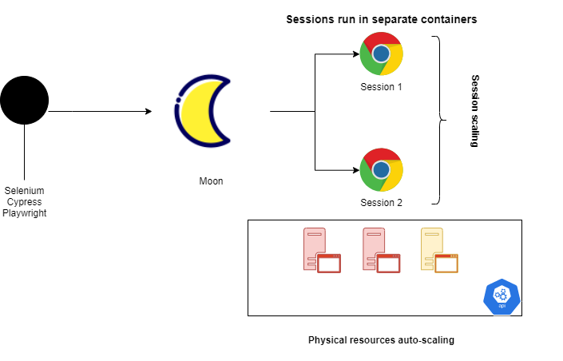

## Load testing with a browser

When can you be tempted to do that ?

- you have no other options (e.g. one cannot correlate the traffic at the protocol level)
- you want to simulate user traffic in the best way possible
- your tests are relatively small ane worth the expense

***

## Browser Load Testing with Selenium and Seleniu Grid



Code
```powershell
    #run with local driver
    cd selenium/
    python test.py

    #run against selenium grid
    cd grid/
    ./start-grid.ps1
    ./start-nodes.ps1 #navigate to http://localhost:4444/grid/console
    python test.py
```
If we want to use more than 1 browser at a time as load testing tool we need to run tests in parallel, which can be achieved:
- with code-specific mechanisms e.g. pytest-parallel, pytest-xdist
- with external script

```powershell
    cd ./runner
    ./parallelRunner.ps1 #will run 4 parallel sessions

```
This way we can mix any kind of solution (playwright, cypress, selenium) in one. 

The solution we have allows us to run as many browsers as we can on our infrastructure but still within the limits of our nodes (their capacity). What we need for load tests is auto-scaling of both browsers and infrastructure. Let us see how we can achieve that with Moon.


## Moon architecture

Moon is a commercial 'Browsers Grid' that runs on Kubernetes natively. For our siltuon we can install Moon on Kubernetes and define auto-scalign rules for:

- browser instances
- hardware it runs on



